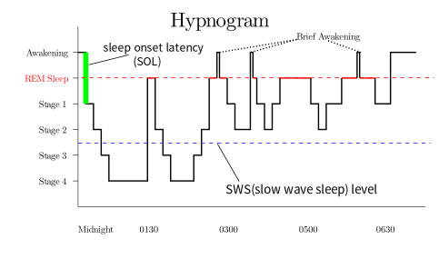

# Sleep

## Introduction

What is sleep? It is a time where your conscious mind shuts off, allowing you to regenerate. In order to fall asleep, you will have to become tired first. Being tired is in part a hormonal state your body induces as a result of exterior influences. Melatonin, a hormon repsonsible for controling the day-night-cycle within the human body, will be exerted when it becomes dark. Besides light, also noises or other sources of stress may hinder a person from falling asleep. 

On the other hand, possible reasons a person may become tired faster, are performing physical exercise or straining cognitive tasks. 

Once asleep, the person will go through a series of different sleep states, ranging from Rapid Eye Movement (REM) to different non-REM sleep phases. The REM state is where the persons dreams and experiences many of the most beneficial aspects of sleep such strengthening neural structure. Over the course of the night the length and frequency of REM stages increases. Therefore the quality of sleep can not be assigned linearly to the amount of sleep a person got or missed.

Sleep deprivation can have negative long term effects on the health of the person. Science indicates that neurological disorders found in people of older age may be linked to the quality of sleep.

## Game Idea

### Simulation

Our game will be a simulation on the topic of "sleep". A simulation is characterized by the use of differently weighted parameters that constantly influence the events. If the parameters are the same, the simulation will always run the same way. Due to human input or random events, there will almost never be two identical simulations. When simulation is the main component of a game, the goal is often to optimize certain values. In terms of business, simulation is used to optimize costs while keeping other values stable, such as employee satisfaction, safety levels, or public perception. Adjusting the possible parameters of a system to achieve an optimum can be both a challenging and rewarding task, especially when the parameters have a non-linear effect. Think here of the shower or the oven, whose heat one often intentionally overshoots because of the delay in starting it, only to turn it back to the desired temperature afterwards. Some parameters can have an exponential effect, a tendency that people often underestimate. 

### Concept

The goal of the player will be to optimze parameters and values revolving around sleep. Different parameters may be:

- Melatonin
- REM
- Non-REM
- Caffeine
- Brightness
- Stress
- Loudness
- Fatigue
- energy
- health
- Nutrition
- body temperature
- Life expectancy
- neuroplasticity
- hormone levels
- Oxygen levels
- sleep duration
- sleep interval

In order to set these parameters the player will have to adjust a schedule defining when the player shall go to bed, be awake and perform physical or cognitive tasks. Furthermore the interior and exterior may have effects on the persons sleep cycle. For instance a lot of light polution may hinder the person from becoming tired due to lower Melatonin levels. The same is true for noises and other sources of stress. The short and long term effects of bad sleep management should become easily discernable for the player.
